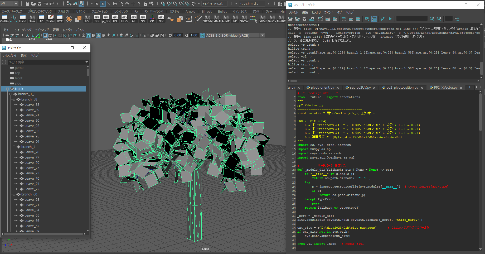
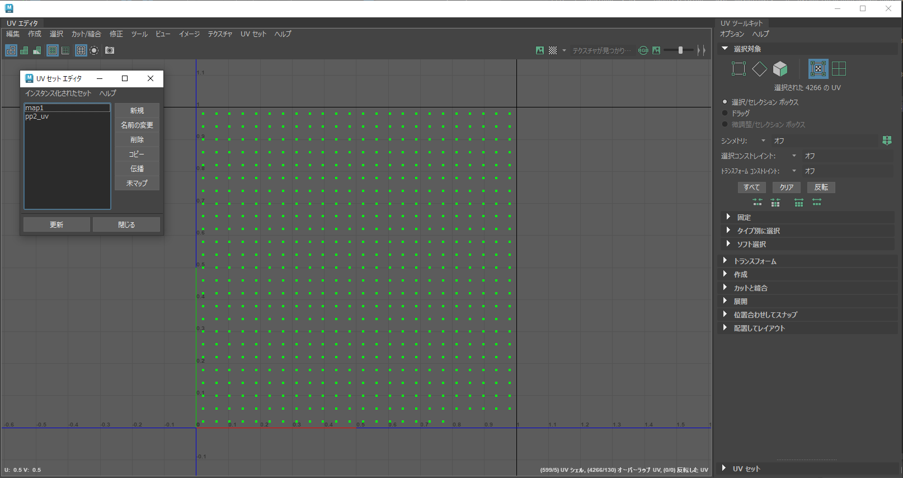

# Pivot Painter 2 – X-Vector & Pivot Position Exporter for Maya

This repository contains Python scripts for exporting **Pivot Painter 2** compatible textures from Autodesk Maya.  
It supports the generation of:

- **Pivot Position Texture** (EXR, 32-bit float)
- **X-Vector Texture** (PNG, 8-bit RGBA)

These textures can be imported into Unreal Engine 5 for use with the **Pivot Painter 2** wind and foliage animation system.

---

## Features
- Generates textures based on a **hierarchical mesh structure** (e.g., Trunk → Branch → Leaves).
- Automatically creates/sets a dedicated UV set (`pp2_uv`).
- Supports arbitrary output directories and file names.
- Exports:
  - **Pivot Position** (EXR)
  - **X-Vector + Hierarchy Depth Alpha** (PNG)

---

## Example

**1. Hierarchical Structure and Model**
  
The trunk is the root, with branches and leaves arranged hierarchically.  
The script samples transforms in world space to compute pivot positions and X-vectors.

**2. UV Set Layout**
  
A dedicated UV set `pp2_uv` is laid out as a grid.  
Each cell corresponds to one mesh element (leaf, branch, etc.).

---

## Requirements
- **Autodesk Maya** 2020+ (tested in Maya 2023)
- **Python 3.9+**
- [NumPy](https://numpy.org/)
- [Pillow](https://pypi.org/project/Pillow/)

> NumPy and Pillow can be bundled in the `third_party/` directory, but it is recommended that users install the latest versions themselves.

---

## Usage
1. Open Maya and load your foliage asset with a proper hierarchy.
2. Select the root transform (e.g., `trunk`).
3. Execute:
   ```python
   from pp2_pivotposition_texture import PP2PivotPosExporter
   from pp2_xvector_texture import PP2XVectorExporter

   PP2PivotPosExporter().export()
   PP2XVectorExporter().export()
