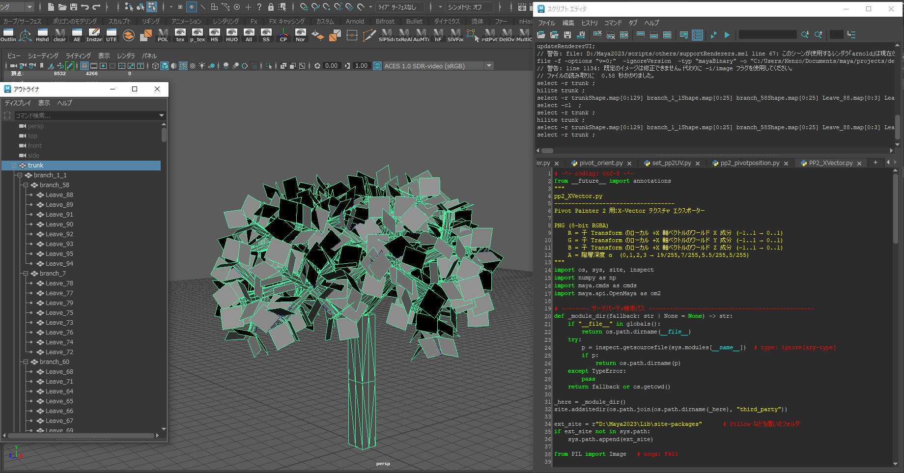

---

## **README_ja.md**
```markdown
# Pivot Painter 2 – X-Vector & Pivot Position Exporter for Maya

本リポジトリは Autodesk Maya 用の **Pivot Painter 2 対応テクスチャ書き出しスクリプト** を収録しています。  
以下のテクスチャを生成できます：

- **Pivot Position テクスチャ**（EXR, 32-bit float）
- **X-Vector テクスチャ**（PNG, 8-bit RGBA）

生成したテクスチャは Unreal Engine 5 にインポートし、**Pivot Painter 2** の風や樹木アニメーションシステムで使用できます。

---

## 特徴
- **階層構造**（例：Trunk → Branch → Leaves）に基づいて自動でテクスチャを生成
- 専用 UV セット (`pp2_uv`) を自動作成・設定
- 出力先ディレクトリやファイル名を指定可能
- 出力内容：
  - **Pivot Position**（EXR）
  - **X-Vector + 階層深度 α**（PNG）

---

## 使用例

**1. モデル階層構造**
  
幹（Trunk）をルートに、枝・葉が階層的に配置された構造。  
スクリプトはワールド空間でのトランスフォーム情報から Pivot 位置と X ベクトルを計算します。

**2. UV セット構成**
  
専用 UV セット `pp2_uv` がグリッド状に展開されています。  
各セルが個別のメッシュ要素（葉や枝など）に対応します。

---

## 必要環境
- **Autodesk Maya** 2020 以降（Maya 2023 にて動作確認済み）
- **Python 3.9+**
- [NumPy](https://numpy.org/)
- [Pillow](https://pypi.org/project/Pillow/)

> NumPy や Pillow は `third_party/` に同梱可能ですが、利用者自身が最新版をインストールすることを推奨します。

---

## 使い方
1. Maya で階層構造を持つ樹木などのモデルを開く
2. ルートとなる Transform（例：`trunk`）を選択
3. 以下を実行：
   ```python
   from pp2_pivotposition_texture import PP2PivotPosExporter
   from pp2_xvector_texture import PP2XVectorExporter

   PP2PivotPosExporter().export()
   PP2XVectorExporter().export()
